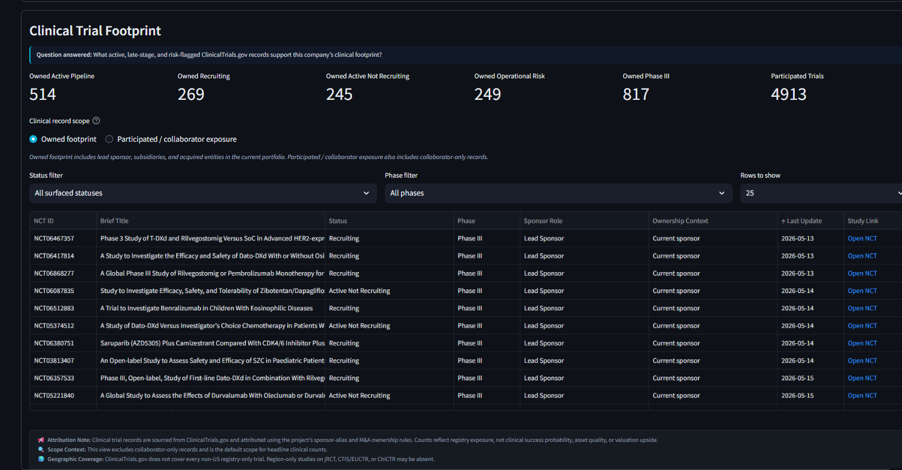
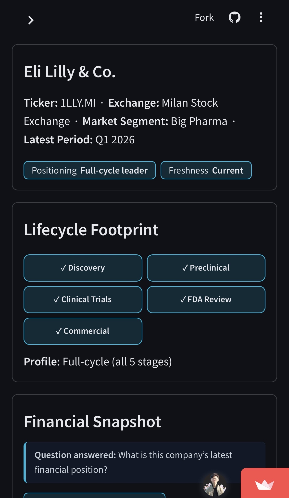
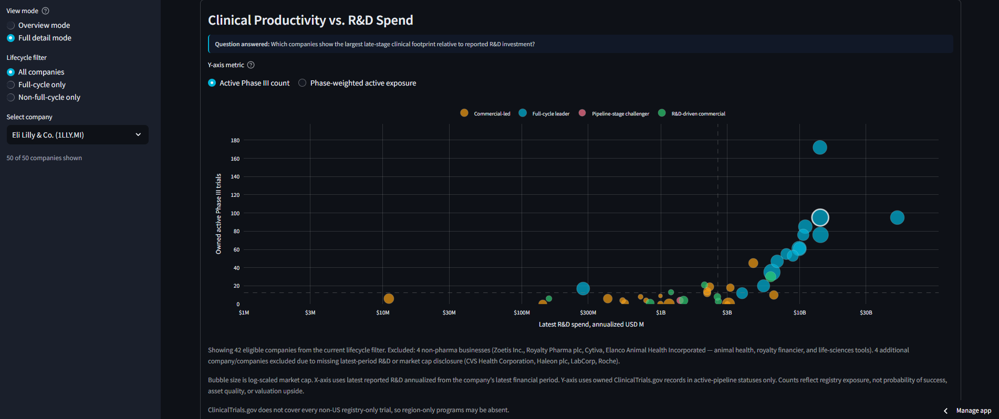
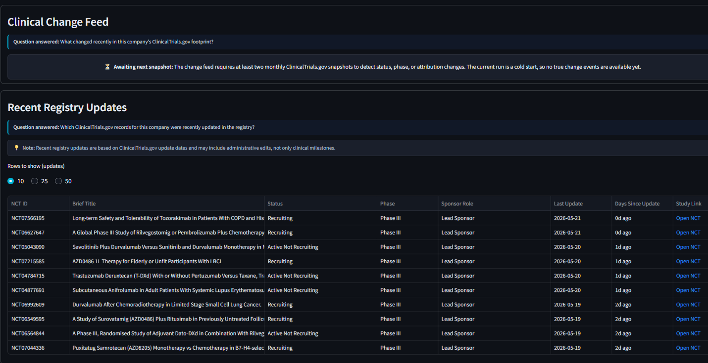

# Biopharma Command Center

An intelligence layer for the Top 50 biopharma companies, bridging reported financial discipline with ClinicalTrials.gov reality. The app is built on committed CSV datasets with strict attribution rules, hybrid reporting-cadence handling, and an auditable data trail.

> **Live app:** https://pharmabiotechmapping-ewsetptbhsm3npjygtssc5.streamlit.app/
>
> **Status:** MVP-2 dashboard integration is live. The app includes the MVP-1 financial dashboard, Clinical Productivity vs. R&D Spend bridge chart, company clinical KPI/NCT detail panel, change-feed cold-start scaffold, recent registry updates panel, lifecycle filter, and mobile-friendly **Overview / Full detail** modes. The true change feed remains in cold-start state until the next monthly ClinicalTrials.gov snapshot.

---

## Screenshots

### Financial × clinical bridge



**Financial × clinical bridge.** Reported R&D spend is compared with owned active Phase III trial exposure from ClinicalTrials.gov. Bubble size is log-scaled market cap; color shows strategic positioning.

### Mobile-first overview mode



**Mobile-first overview mode.** Overview mode prioritizes summary cards and ranked context for quick review, while Full detail mode keeps the complete analytical charts for desktop exploration.

### Company clinical trial footprint



**Company clinical drill-through.** KPI cards summarize owned and participated ClinicalTrials.gov exposure, while the NCT table links back to the underlying registry records.

### Change feed cold-start and recent registry updates



**Change-feed scaffold.** True status/phase/attribution change detection waits for the next monthly snapshot; recent registry updates provide near-term visibility without mislabeling administrative edits as clinical events.

---

## What the dashboard answers

| Section | Question it answers |
|---|---|
| Sector Overview | What is the aggregate size and latest broad-coverage revenue base of the selected universe? |
| Sector Trend | Is the universe becoming more research-intensive, more cash-rich, or more SG&A-heavy over time? |
| Intelligence Map | How does this company compare commercially and scientifically with peers? |
| Strategic Posture Quadrant | Does this company have the cash buffer to support its R&D intensity? |
| Clinical Productivity vs. R&D Spend | Which companies show the largest late-stage clinical footprint relative to reported R&D investment? |
| Lifecycle Footprint | Where does this company participate across the therapeutic product lifecycle? |
| Financial Snapshot | What is this company's latest reported financial position? |
| Clinical Trial Footprint | What active, late-stage, and risk-flagged ClinicalTrials.gov records support this company's clinical footprint? |
| Clinical Change Feed | What changed recently in this company's ClinicalTrials.gov footprint? |
| Recent Registry Updates | Which ClinicalTrials.gov records for this company were recently updated in the registry? |
| Financial Trend | How has this company's reported financial profile changed over time without mixing reporting cadences? |
| Data Sources panel | Can I trace where the company's financial and profile data came from? |

---

## Methodology in three points

This dashboard exists because cross-company biopharma comparison is hard to do honestly. Three rules drive the charts, tables, and KPIs.

### 1. Dollar-weighted aggregation, not means-of-ratios

Sector-level ratios are computed as `Σ numerator ÷ Σ denominator` across paired rows where both parts are disclosed, not as the average of per-company ratios. A simple mean over R&D Intensity values would weight a $50M biotech equally with Pfizer; dollar-weighting reflects the sector's actual capital/revenue composition.

Coverage floors prevent one-company leading-edge periods from being mistaken for sector trends:

- 50% minimum reporters per metric per quarter for sector trends
- 80% broad-coverage rule for the headline revenue base

### 2. Calendar-quarter alignment for mixed cadences

Companies disclose financials on different fiscal calendars and cadences. Sector trends use Q1–Q4 rows only and group by `Calendar_Quarter`, not the company's fiscal `Period_Type`. FY, H1, and 9M reporters are surfaced in per-company views as separate cadence lines; they are not blended into quarterly sector trends.

Where a disclosed fiscal quarter differs from the normalized calendar quarter, both labels are shown.

### 3. Honest gaps over confident guesses

Where a company does not disclose a metric, the dashboard shows a blank rather than a proxy. Where a trial is registered under a subsidiary name not yet in the alias map, the gap is documented rather than silently papered over.

The principle: every visible number should have a defensible answer if someone asks, "Where did this come from?"

---

## Data layers

### Financial layer

Two committed CSVs cover 2024–2026 reported periods for 50 companies across NYSE, NASDAQ, TSE, HKEX, and major European exchanges.

| File | Purpose |
|---|---|
| `data/Company_Master.csv` | Company identity, exchange, lifecycle flags, positioning inputs, source metadata |
| `data/Quarterly_Financials.csv` | Reported revenue, R&D, SG&A, cash, and market cap by disclosed period |
| `data/Dashboard_Data_Notes.csv` | Notes and caveats surfaced in selected dashboard views |

Periods are stored as disclosed (`Q1`–`Q4`, `H1`, `9M`, `FY`). Values are normalized to USD millions for cross-company comparison.

### Clinical-trial layer

Clinical data is built from ClinicalTrials.gov API v2 with an M&A-aware sponsor matching overlay.

| Layer | Purpose |
|---|---|
| `data/clinical_trials/ClinicalTrials_Inventory.csv` | Raw one-row-per-company-NCT match table |
| `data/clinical_trials/ClinicalTrials_Inventory_Normalized.csv` | Adds status buckets, phase buckets, phase weights, and filter-contract booleans |
| `data/clinical_trials/ClinicalTrials_Status_Summary.csv` | One-row-per-company KPI summary used by the dashboard |
| `data/clinical_trials/ClinicalTrials_Change_Feed.csv` | Append-only status/phase/attribution event log; currently cold-start |
| `data/clinical_trials/Expected_Zero_Companies.csv` | Explicit expected-zero documentation for Zoetis, Royalty Pharma, Danaher, and Elanco |
| `data/clinical_trials/Sponsor_Alias_Map.csv` | M&A-aware sponsor/subsidiary/acquired-entity alias map |
| `data/clinical_trials/ClinicalTrials_Alias_Reconciliation.csv` | Per-alias API yield and matching reconciliation |

The deployed app reads committed CSVs only. It does **not** call ClinicalTrials.gov live at runtime.

---

## What makes this defensible

### M&A-aware sponsor attribution

ClinicalTrials.gov sponsor search treats entities like `Pfizer` and `Seagen` as separate sponsors. The dashboard uses an M&A-aware alias layer so acquired or subsidiary-sponsored trials can be attributed to the current parent when the ownership rule supports it.

Examples covered by the alias map include Roche/Genentech, Pfizer/Seagen, AbbVie/Allergan, BMS/Celgene, Takeda/Shire, GSK/ViiV, Sanofi/Genzyme, and regional Japanese pharma subsidiaries.

### Spot-check reconciliation

Nine major companies were reconciled against ClinicalTrials.gov sponsor exports: Pfizer, Roche, Lilly, Vertex, Daiichi Sankyo, J&J, AbbVie, GSK, and Astellas. Where material gaps were found, alias-map rows were added with iteration notes and reviewer rationale.

### Snapshot-based change detection

The change feed is designed as a snapshot diff, not a guessed feed from update dates. It compares the current normalized inventory against the prior monthly snapshot and emits events such as:

- New trial
- Removed from match
- Status changed
- Phase changed
- Attribution changed
- Record updated

The first run is intentionally a cold start. The dashboard says so rather than inventing change events.

### Lifecycle classification with edge-case rules

Lifecycle flags mean meaningful participation in the human therapeutic product lifecycle. For infrastructure companies, flags may reflect enabling role rather than asset ownership. For animal-health companies, human therapeutic stages are set to `FALSE` in the current MVP scope. Partnered/co-commercialized products and branded generics/biosimilars are handled through documented edge-case rules in the lifecycle audit trail.

---

## Known limitations

- **Not an investment recommendation.** No fair-value estimates, price targets, or valuation upside calculations are produced.
- **ClinicalTrials.gov scope only.** Trials registered exclusively on jRCT, CTIS/EUCTR, ChiCTR, or other regional registries may be absent.
- **Registry exposure is not clinical quality.** Active Phase III count is a registry-derived exposure measure, not a probability-of-approval forecast or asset-quality score.
- **R&D Intensity is not pipeline quality.** It measures spending commitment relative to revenue.
- **Cash / Market Cap is not valuation upside.** It measures balance-sheet buffer relative to public market value.
- **Change feed is cold-start.** True status/phase/attribution changes appear only after at least two dated snapshots exist.
- **Alias coverage is iterative.** The largest sponsor attribution risks are documented and spot-checked, but smaller residual alias gaps may remain.

---

## Repository structure

```text
.
├── app.py
├── charts.py
├── data.py
├── README.md
├── requirements.txt
├── .streamlit/
│   └── config.toml
├── data/
│   ├── Company_Master.csv
│   ├── Quarterly_Financials.csv
│   ├── Dashboard_Data_Notes.csv
│   └── clinical_trials/
│       ├── ClinicalTrials_Inventory.csv
│       ├── ClinicalTrials_Inventory_Normalized.csv
│       ├── ClinicalTrials_Status_Summary.csv
│       ├── ClinicalTrials_Change_Feed.csv
│       ├── Expected_Zero_Companies.csv
│       ├── Sponsor_Alias_Map.csv
│       └── snapshots/
├── audit/
│   └── lifecycle_column_fix_audit.md
├── docs/
│   └── screenshots/
│       ├── 01_bridge_chart.png
│       ├── 02_mobile_overview.png
│       ├── 03_clinical_footprint_nct_table.png
│       └── 04_change_feed_recent_updates.png
└── scripts/
    ├── fetch_clinicaltrials_v2.py
    ├── build_clinical_signals.py
    ├── build_status_summary.py
    └── build_change_feed.py
```

---

## Running locally

```bash
pip install -r requirements.txt
streamlit run app.py
```

The app expects all CSVs to be committed under `data/` and `data/clinical_trials/`. Large clinical detail files should be uploaded through Git/GitHub Desktop rather than GitHub's browser editor.

---

## Deployment verification checklist

Before treating the deployment as final:

- [ ] Streamlit app loads from the live URL.
- [ ] Sidebar `Overview mode` works on mobile-width layout.
- [ ] `Full detail mode` shows full bubble charts on desktop.
- [ ] `ClinicalTrials_Inventory_Normalized.csv` is committed under `data/clinical_trials/`.
- [ ] Clinical Trial Footprint table shows clickable NCT links.
- [ ] Change Feed shows cold-start placeholder when no true diff events exist.
- [ ] Recent Registry Updates panel displays selected-company registry updates.
- [ ] No external API calls are required at app runtime.

---

## Build phases

### MVP-1 — Financial intelligence layer

| Phase | Status | Output | Purpose |
|---|---|---|---|
| MVP-1 P1 — Company universe setup | Complete | `Company_Master.csv` | Defines the Top 50 company universe, identifiers, exchanges, lifecycle flags, source metadata, and dashboard filter fields. |
| MVP-1 P2 — Financial data extraction | Complete | `Quarterly_Financials.csv` | Structures reported revenue, R&D, SG&A, cash, and market cap across 2024–2026 reported periods. |
| MVP-1 P3 — Cadence and calendar-quarter handling | Complete | Period/cadence logic in CSV + loaders | Keeps Q1–Q4, H1, 9M, and FY reporters comparable without creating synthetic quarters. |
| MVP-1 P4 — Financial validation and audit | Complete | validation checks + `Dashboard_Data_Notes.csv` | Captures data caveats, sparse periods, duplicate checks, missing values, and latest-period selection logic. |
| MVP-1 P5 — Dashboard integration | Complete | Streamlit financial dashboard | Renders Sector Overview, Sector Trend, Intelligence Map, Strategic Posture, Lifecycle Footprint, Financial Snapshot, Financial Trend, and Data Sources sections. |

### MVP-2 — Clinical-trial intelligence layer

| Phase | Status | Output | Purpose |
|---|---|---|---|
| MVP-2 P1 — ClinicalTrials.gov fetch | Complete | `ClinicalTrials_Inventory.csv` | Builds one row per company-NCT match with sponsor alias and M&A-aware attribution. |
| MVP-2 P2 — Trial normalization | Complete | `ClinicalTrials_Inventory_Normalized.csv` | Adds status buckets, phase buckets, phase weights, and owned/participated filter flags. |
| MVP-2 P3 — Company clinical summary | Complete | `ClinicalTrials_Status_Summary.csv` | Aggregates row-level trial data into one-row-per-company KPI inputs. |
| MVP-2 P4 — Snapshot change feed | Cold-start | `ClinicalTrials_Change_Feed.csv` | Detects new/status/phase/attribution changes once at least two snapshots exist. |
| MVP-2 P5a — Bridge chart | Complete | Clinical Productivity vs. R&D Spend | Connects annualized R&D spend to owned active Phase III / phase-weighted clinical exposure. |
| MVP-2 P5b — Clinical detail panel | Complete | Clinical Trial Footprint | Adds company KPI cards, owned/participated scope, NCT-level table, and registry links. |
| MVP-2 P5c — Lifecycle audit | Complete / reviewable | `lifecycle_column_fix_audit.md` | Documents lifecycle edge-case rules and validates lifecycle filter behavior. |
| MVP-2 P5d — Change-feed scaffold | Complete | Clinical Change Feed + Recent Registry Updates | Shows cold-start state honestly while surfacing recent registry update context. |
| MVP-2 P5e — README polish | Complete | Portfolio-facing documentation | Updates screenshots, project narrative, deployment checks, and roadmap. |

---

## Roadmap

| Phase | Status | Notes |
|---|---|---|
| MVP-1 financial dashboard | Complete | Sector overview, trends, intelligence map, strategic posture, company financial detail |
| MVP-2 P1 clinical fetch | Complete | ClinicalTrials.gov API v2 inventory with sponsor alias attribution |
| MVP-2 P2 normalization | Complete | Status, phase, weight, and ownership/participation helper columns |
| MVP-2 P3 company summary | Complete | One-row-per-company clinical KPI table |
| MVP-2 P4 change feed | Cold-start | Activates after the next monthly snapshot |
| MVP-2 P5a bridge chart | Complete | Clinical Productivity vs. R&D Spend |
| MVP-2 P5b clinical detail | Complete | KPI cards and NCT-level table |
| MVP-2 P5c lifecycle audit | Complete / reviewable | Edge-case rules documented; can be refined as scope changes |
| MVP-2 P5d change-feed scaffold | Complete | Cold-start state + recent registry updates |
| MVP-2 P5e README polish | Complete | Portfolio-facing documentation |
| MVP-3 network map | Future | Asset, indication, and partnership graph |
| MVP-3 multi-registry expansion | Future | WHO ICTRP / CTIS / jRCT / ChiCTR integration |

---

## Why this project matters

The project is intentionally small in surface area but dense in methodology. It demonstrates:

- financial data validation and reporting-cadence handling,
- data modeling across company, financial, and clinical layers,
- ClinicalTrials.gov API v2 extraction and normalization,
- M&A-aware entity resolution,
- auditable ETL design,
- Streamlit product design for both mobile overview and desktop detail,
- stakeholder-ready communication of methodology, uncertainty, and data limitations.

